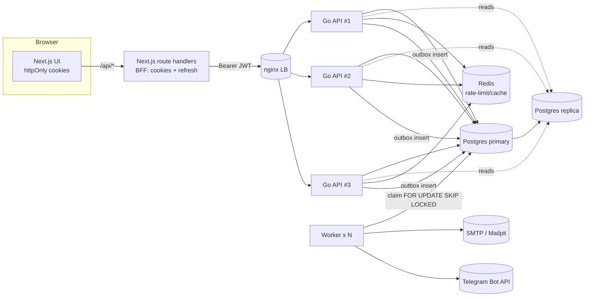

# Kabanos 🐗

Платформа для контроля здоровья: вода, калории и блюда, таблетки/витамины,
тренировки и упражнения, вес, а также планировщик дня и Telegram‑дайджест.

Это монорепозиторий с бэкендом на **Go** и фронтендом на **Next.js**, собранный
по современным практикам: строгая слоистая архитектура, транзакционный outbox,
ротация refresh‑токенов, stateless‑API для горизонтального масштабирования и
готовность к репликации Postgres.

> **Статус.** Реализовано отказоустойчивое **ядро** и два раздела end‑to‑end:
> **Авторизация** (email + пароль с подтверждением почты) и трекеры **Воды** и
> **Веса**. Остальные разделы (калории/блюда, таблетки, тренировки, планировщик,
> Telegram‑бот) проектируются поверх той же архитектуры — см.
> [Роадмап](#роадмап) и [Открытые вопросы](#открытые-продуктовые-вопросы).

---

## Содержание

- [Что готово](#что-готово)
- [Технологии и решения](#технологии-и-решения)
- [Архитектура](#архитектура)
- [Быстрый старт](#быстрый-старт)
- [Переменные окружения](#переменные-окружения)
- [Локальная разработка](#локальная-разработка)
- [API](#api)
- [Отказоустойчивость и репликация](#отказоустойчивость-и-репликация)
- [Безопасность](#безопасность)
- [Тестирование](#тестирование)
- [Структура проекта](#структура-проекта)
- [Роадмап](#роадмап)
- [Открытые продуктовые вопросы](#открытые-продуктовые-вопросы)

---

## Что готово

| Раздел | Готово |
|---|---|
| **Авторизация** | Регистрация, вход, подтверждение email, сброс пароля, refresh‑токены с ротацией и защитой от повторного использования, профиль (рост, пол, telegram) |
| **Вода** | Дневная цель, наполнение ёмкости из стакана/бутылок/своего объёма, лог за день, история за 14 дней (график), корректный расчёт «дня» в таймзоне пользователя |
| **Вес** | Ввод веса и цели, график динамики с целевой линией, расчёт ИМТ и категории ВОЗ, история измерений |
| **Инфраструктура** | Docker/Compose, авто‑миграции с advisory‑lock, health/readiness‑пробы, graceful shutdown, rate‑limit на Redis, транзакционный outbox + воркер, SMTP‑почта (Mailpit в dev), балансировщик и топология с репликацией Postgres |

---

## Технологии и решения

**Backend (Go 1.23)**

- **`net/http` + `chi`** — маршрутизация без тяжёлого фреймворка.
- **`pgx/v5` (pgxpool)** — прямой, типобезопасный доступ к Postgres. Репозитории
  пишут SQL явно: предсказуемо и без магии ORM.
- **`goose`** — SQL‑миграции, **встроенные в бинарник** (`embed`) и применяемые на
  старте под **advisory‑lock** (безопасно при нескольких репликах).
- **`golang-jwt/v5` + Argon2id** — короткоживущие access‑JWT и хешированные
  refresh‑токены с ротацией.
- **`redis/go-redis/v9`** — распределённый rate‑limit (общий для всех реплик).
- **`log/slog`** — структурные логи (JSON в проде), корреляция по `request_id`.
- **Транзакционный outbox** — побочные эффекты (письма, Telegram) пишутся в БД в
  одной транзакции с бизнес‑изменением и доставляются воркером (at‑least‑once,
  без брокера).

**Frontend (Next.js 15, App Router)**

- **TypeScript + Tailwind + TanStack Query**.
- **BFF‑паттерн**: браузер общается только со своими route handlers Next.js;
  токены хранятся в **httpOnly‑куках** и никогда не попадают в JS. Access‑токен
  прозрачно обновляется на 401. Это закрывает кражу токенов через XSS и убирает
  CORS из браузера.
- **Recharts** — графики воды и веса.

**Почему так.** Ядро stateless (состояние — только в Postgres/Redis), поэтому
API и воркер масштабируются горизонтально; тяжёлые чтения можно направлять на
реплики Postgres. Планировщик спроектирован через интерфейс `Planner`, чтобы
позже добавить синхронизацию с Google Calendar без переписывания вызовов.

---

## Архитектура



- **Запись** и «read‑your‑write» — на primary; необязательные тяжёлые чтения — на
  реплики (round‑robin, с деградацией на primary при недоступности реплики).
- **Воркер** забирает outbox‑сообщения через `FOR UPDATE SKIP LOCKED`, поэтому
  несколько воркеров работают параллельно без двойной доставки.

---

## Быстрый старт

Нужен только **Docker** (Desktop/Engine) с Compose v2.

```bash
cp .env.example .env        # можно не менять для локального запуска
docker compose up --build -d
```

Доступы:

| Сервис | URL |
|---|---|
| Веб‑приложение | http://localhost:3000 |
| API | http://localhost:8080 (`/healthz`, `/readyz`) |
| Почта (Mailpit) | http://localhost:8025 |

Проверка: откройте http://localhost:3000 → зарегистрируйтесь → письмо с
подтверждением появится в **Mailpit** (http://localhost:8025). Дальше — разделы
«Вода» и «Вес».

Остановить: `docker compose down` (данные сохранятся) или `make clean` (с
удалением томов).

---

## Переменные окружения

Все переменные и значения по умолчанию — в [`.env.example`](.env.example).
Ключевые:

- `JWT_SECRET` — **обязательно** задать сильное значение (≥32 символов) в проде
  (`openssl rand -hex 32`). В dev есть небезопасный дефолт.
- `POSTGRES_DSN`, `POSTGRES_REPLICA_DSNS` — primary и (опционально) реплики.
- `PUBLIC_APP_URL` — базовый URL фронта для ссылок в письмах.
- `SMTP_*`, `MAIL_FROM_*` — исходящая почта.
- `TELEGRAM_BOT_TOKEN` — токен бота (для будущего дайджеста).

---

## Локальная разработка

**Backend** (нужен Go 1.23+):

```bash
cd backend
go test ./...     # юнит-тесты
go build ./...    # сборка
go run ./cmd/api  # API (ожидает Postgres/Redis — проще поднять их через compose)
```

**Frontend** (Node 20+):

```bash
cd frontend
npm install
npm run dev       # http://localhost:3000, ожидает API на :8080
```

Удобно: поднять инфраструктуру через `docker compose up postgres redis mailpit api -d`,
а фронт запускать локально `npm run dev`.

`make help` — список полезных команд.

---

## API

Базовый префикс: `/api/v1`. Ответы — JSON; ошибки в едином конверте
`{ "error": { "code", "message", "fields?" } }`.

**Публичные (auth):**

| Метод | Путь | Назначение |
|---|---|---|
| POST | `/auth/register` | Регистрация (сразу вход + письмо‑подтверждение) |
| POST | `/auth/login` | Вход |
| POST | `/auth/refresh` | Ротация refresh‑токена |
| POST | `/auth/logout` | Отзыв refresh‑токена |
| POST | `/auth/verify-email` | Подтверждение email по токену |
| POST | `/auth/forgot-password` | Запрос сброса пароля |
| POST | `/auth/reset-password` | Установка нового пароля |

**Требуют `Authorization: Bearer <access>`:**

| Метод | Путь | Назначение |
|---|---|---|
| GET | `/me` · PATCH `/me` | Профиль (в т.ч. рост для ИМТ, telegram) |
| POST | `/auth/resend-verification` | Повторное письмо‑подтверждение |
| GET/PUT | `/water/goal` | Дневная цель по воде |
| GET | `/water/day?date&tz` | Сводка за день |
| POST | `/water/intake` · DELETE `/water/intake/{id}` | Учёт воды |
| GET | `/water/history?from&to&tz` | История по дням |
| GET | `/weight/summary?limit` | Текущий вес, цель, ИМТ, ряд |
| PUT | `/weight/goal` · POST `/weight/entries` · DELETE `/weight/entries/{id}` | Цель и измерения веса |

Пример:

```bash
# регистрация
curl -s localhost:8080/api/v1/auth/register \
  -H 'content-type: application/json' \
  -d '{"email":"me@example.com","password":"supersecret","displayName":"Захар"}'

# затем с полученным accessToken:
curl -s localhost:8080/api/v1/water/intake \
  -H "authorization: Bearer $ACCESS" -H 'content-type: application/json' \
  -d '{"amountMl":500,"source":"bottle_small"}'
```

> В браузере всё это идёт через BFF (`/api/*` на 3000), а токены живут в
> httpOnly‑куках — прямой доступ к :8080 нужен только для интеграций/отладки.

---

## Отказоустойчивость и репликация

Ядро **stateless** — состояние только в Postgres и Redis. Отсюда:

- **API и воркер масштабируются горизонтально.** rate‑limit общий (Redis),
  outbox безопасен при многих воркерах (`SKIP LOCKED`), миграции — под
  advisory‑lock.
- **Graceful shutdown**: по `SIGTERM` сервер дораздаёт запросы в пределах таймаута
  — безопасные rolling‑деплои и автоскейлинг.
- **Пробы** `/healthz` (liveness) и `/readyz` (проверяет Postgres и Redis) —
  для оркестратора/балансировщика.
- **Реплики Postgres**: `POSTGRES_REPLICA_DSNS` включает раздачу тяжёлых чтений на
  реплики; при их недоступности чтения деградируют на primary.

Готовая «боевая» топология — в [`docker-compose.scale.yml`](docker-compose.scale.yml):
primary + streaming‑реплика Postgres, **3 реплики API за nginx**, **2 воркера**,
общий Redis.

```bash
export JWT_SECRET=$(openssl rand -hex 32)
docker compose -f docker-compose.scale.yml up --build -d
# масштабировать на лету:
docker compose -f docker-compose.scale.yml up -d --scale api=5
```

Балансировщик [`deploy/nginx/nginx.conf`](deploy/nginx/nginx.conf) раздаёт запросы
по всем репликам API (через встроенный DNS Docker) и переключается на живую
реплику при сбое (`proxy_next_upstream`).

---

## Безопасность

- **Пароли** — Argon2id (memory‑hard, параметры зашиты в хеш).
- **Токены** — короткий access‑JWT (HS256) + refresh с **ротацией**; повторное
  использование отозванного refresh трактуется как кража → отзыв всей «семьи»
  токенов пользователя. Сброс пароля отзывает все сессии.
- **Хранение на клиенте** — только httpOnly‑куки на домене фронта (BFF); токены
  недоступны JS.
- **Rate‑limit** — жёстче на `/auth` (по IP), общий бюджет на остальное (по
  пользователю); распределённый через Redis.
- **Прочее** — строгий разбор JSON (лимит тела, запрет неизвестных полей), CORS с
  allow‑list, единый формат ошибок без утечки внутренних деталей, антиэнумерация
  на login/forgot‑password.
- **Образы** — API/worker на **distroless (nonroot, static)**: без shell и
  пакетного менеджера, минимальная поверхность атаки.

---

## Тестирование

```bash
cd backend && go test ./...
```

Покрыты: хеширование/проверка паролей (соль, отказ на битом хеше), расчёт ИМТ и
категорий, таймзоно‑зависимая арифметика «дня». Слои разделены (handler →
service → repo), поэтому сервисы легко покрывать дальше.

---

## Структура проекта

```
kabanos/
├─ backend/                 # Go API + worker
│  ├─ cmd/api               # HTTP‑сервер (stateless)
│  ├─ cmd/worker            # доставка outbox (письма/telegram)
│  ├─ migrations/           # SQL‑миграции (goose), встроены в бинарь
│  └─ internal/
│     ├─ config observability httpx postgres redisx validate timex
│     ├─ auth user           # идентичность, токены, профиль
│     ├─ water weight        # доменные разделы (model/repo/service/handler)
│     ├─ outbox mailer notify# асинхронные побочные эффекты
│     └─ scheduler           # интерфейс планировщика (seam под Google Calendar)
├─ frontend/                # Next.js (App Router)
│  └─ src/
│     ├─ app/(auth) app/(app)# страницы: логин/регистрация, дашборд, вода, вес…
│     ├─ app/api/*           # BFF: прокси к Go + управление куками
│     ├─ components hooks lib # UI, data‑хуки (TanStack), клиент API
│     └─ middleware.ts       # защита роутов
├─ deploy/nginx/            # конфиг балансировщика API
├─ docker-compose.yml       # локальный стек
├─ docker-compose.scale.yml # HA‑топология (репликация + реплики API/worker)
└─ Makefile .env.example
```

---

## Роадмап

Следующие срезы подключаются поверх готового ядра (та же схема
model/repo/service/handler + outbox + планировщик):

1. **Калории и блюда** — цели БЖУ/ккал, ручной ввод и выбор блюда, разделы «мои /
   все / избранное», рецепты, фото, комментарии и оценки, добавление в рацион,
   вычитание активностью, графики за день и история рационов.
2. **Таблетки/витамины** — названия и периодичность, UI «приёма», недельный учёт.
3. **Тренировки и упражнения** — упражнения с атрибутами (снаряды, сложность,
   нагрузка на суставы, кардио/сила), медиа, оценки/комментарии; программы
   тренировок с порядком упражнений.
4. **Планировщик и Telegram** — рационы/тренировки/активности на даты,
   напоминания, утренний дайджест в бота (в т.ч. расчёт дефицита калорий) через
   уже заложенные `Planner` и outbox `telegram.daily_digest`.

---

## Открытые продуктовые вопросы

Чтобы следующий срез (калории) попал в цель:

- **Единицы блюд.** Калорийность на 100 г и порция, или сразу на порцию? Нужны ли
  граммовки ингредиентов?
- **Активности/тренировки → калории.** Считать по MET‑таблицам (тип+вес+время)
  или пользователь вводит «сожжено ккал» вручную?
- **Модерация общих блюд/упражнений.** Любой пользователь публикует в «Все»
  сразу, или нужна премодерация/жалобы?
- **Фото/медиа.** Хранить в объектном хранилище (S3/MinIO) — заложить сразу?
- **Дефицит калорий.** Норма фиксированная у пользователя, или пересчитывать по
  цели веса и активности?

Ответьте на удобные — и я продолжу следующим вертикальным срезом.
