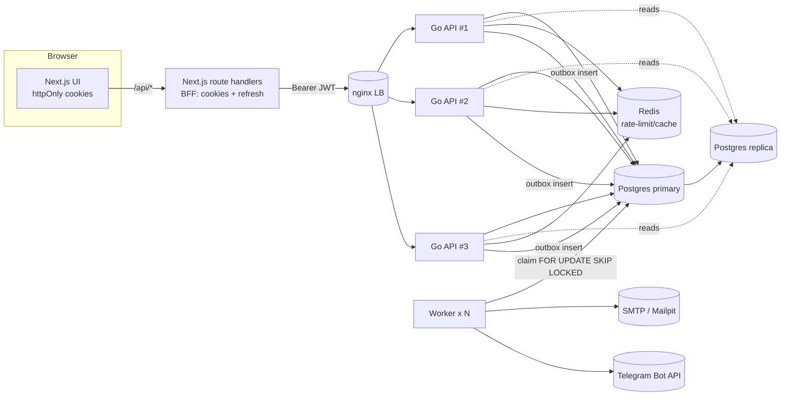

# Kabanos 🐗

Платформа для контроля здоровья: вода, калории и блюда, таблетки/витамины,
тренировки и упражнения, вес, а также планировщик дня и Telegram‑дайджест.

Это монорепозиторий с бэкендом на **Go** и фронтендом на **Next.js**, собранный
по современным практикам: строгая слоистая архитектура, транзакционный outbox,
ротация refresh‑токенов, stateless‑API для горизонтального масштабирования и
готовность к репликации Postgres.

> **Статус.** Реализовано отказоустойчивое **ядро** и разделы end‑to‑end:
> **Авторизация** (email + пароль с подтверждением почты), трекеры **Воды** и
> **Веса**, **Калории и блюда** (каталог с оценками/комментариями/избранным,
> дневник, активности) и **Тренировки/Упражнения** (общий каталог с оценками,
> комментариями, избранным, медиа; программы с порядком упражнений). Остаются
> **таблетки**, **планировщик** и **Telegram‑бот** — проектируются поверх той же
> архитектуры (см. [Роадмап](#роадмап)).

---

## Содержание

- [Что готово](#что-готово)
- [Технологии и решения](#технологии-и-решения)
- [Архитектура](#архитектура)
- [Быстрый старт](#быстрый-старт)
- [Деплой на облачную VM (production)](#деплой-на-облачную-vm-production)
- [Переменные окружения](#переменные-окружения)
- [Локальная разработка](#локальная-разработка)
- [API](#api)
- [Отказоустойчивость и репликация](#отказоустойчивость-и-репликация)
- [Безопасность](#безопасность)
- [Тестирование](#тестирование)
- [Структура проекта](#структура-проекта)
- [Роадмап](#роадмап)
- [Открытые продуктовые вопросы](#открытые-продуктовые-вопросы)

---

## Что готово

| Раздел | Готово |
|---|---|
| **Авторизация** | Регистрация, вход, подтверждение email, сброс пароля, refresh‑токены с ротацией и защитой от повторного использования, профиль (рост, пол, telegram) |
| **Вода** | Дневная цель, наполнение ёмкости из стакана/бутылок/своего объёма, лог за день, история за 14 дней (график), корректный расчёт «дня» в таймзоне пользователя |
| **Вес** | Ввод веса и цели, график динамики с целевой линией, расчёт ИМТ и категории ВОЗ, история измерений |
| **Калории и блюда** | Цели БЖУ/ккал, ручной ввод и выбор блюда, разделы «мои / все / избранное», рецепты, фото (S3/MinIO), оценки 1–5 и комментарии, добавление в рацион, сжигание калориями (ручное или MET по весу), дневник за день и история |
| **Тренировки и упражнения** | Общий каталог упражнений (снаряды, сложность, нагрузка на суставы, кардио/сила, мышцы, фото + видео‑ссылка) и тренировок (упорядоченный список упражнений с подходами/повторами/отдыхом); «мои / все / избранное», оценки 1–5, комментарии |
| **Таблетки и витамины** | Курсы приёма (доза за приём, число приёмов в день, старт и длительность), дневная «полоска» приёмов с отметкой/отменой, «день X из N», недельная статистика; блок на дашборде |
| **Дашборд** | Настраиваемый из «кубиков»‑виджетов (вода, калории, вес, БЖУ, тренировки, таблетки, быстрые действия): показать/скрыть и переупорядочить, выбор сохраняется; анимированное появление, стиль с маскотом‑кабаном |
| **Инфраструктура** | Docker/Compose, авто‑миграции с advisory‑lock, health/readiness‑пробы, graceful shutdown, rate‑limit на Redis, транзакционный outbox + воркер, объектное хранилище (MinIO/S3), провайдеронезависимая SMTP‑почта (Mailpit в dev, TLS/STARTTLS в проде), балансировщик и топология с репликацией Postgres |

---

## Технологии и решения

**Backend (Go 1.25)**

- **`net/http` + `chi`** — маршрутизация без тяжёлого фреймворка.
- **`pgx/v5` (pgxpool)** — прямой, типобезопасный доступ к Postgres. Репозитории
  пишут SQL явно: предсказуемо и без магии ORM.
- **`goose`** — SQL‑миграции, **встроенные в бинарник** (`embed`) и применяемые на
  старте под **advisory‑lock** (безопасно при нескольких репликах).
- **`golang-jwt/v5` + Argon2id** — короткоживущие access‑JWT и хешированные
  refresh‑токены с ротацией.
- **`redis/go-redis/v9`** — распределённый rate‑limit (общий для всех реплик).
- **`log/slog`** — структурные логи (JSON в проде), корреляция по `request_id`.
- **Транзакционный outbox** — побочные эффекты (письма, Telegram) пишутся в БД в
  одной транзакции с бизнес‑изменением и доставляются воркером (at‑least‑once,
  без брокера).

**Frontend (Next.js 15, App Router)**

- **TypeScript + Tailwind + TanStack Query**.
- **BFF‑паттерн**: браузер общается только со своими route handlers Next.js;
  токены хранятся в **httpOnly‑куках** и никогда не попадают в JS. Access‑токен
  прозрачно обновляется на 401. Это закрывает кражу токенов через XSS и убирает
  CORS из браузера.
- **Recharts** — графики воды и веса.

**Почему так.** Ядро stateless (состояние — только в Postgres/Redis), поэтому
API и воркер масштабируются горизонтально; тяжёлые чтения можно направлять на
реплики Postgres. Планировщик спроектирован через интерфейс `Planner`, чтобы
позже добавить синхронизацию с Google Calendar без переписывания вызовов.

---

## Архитектура



- **Запись** и «read‑your‑write» — на primary; необязательные тяжёлые чтения — на
  реплики (round‑robin, с деградацией на primary при недоступности реплики).
- **Воркер** забирает outbox‑сообщения через `FOR UPDATE SKIP LOCKED`, поэтому
  несколько воркеров работают параллельно без двойной доставки.

---

## Быстрый старт

Нужен только **Docker** (Desktop/Engine) с Compose v2.

```bash
cp .env.example .env        # можно не менять для локального запуска
docker compose up --build -d
```

Доступы:

| Сервис | URL |
|---|---|
| Веб‑приложение | http://localhost:3000 |
| API | http://localhost:8080 (`/healthz`, `/readyz`) |
| Почта (Mailpit) | http://localhost:8025 |

Проверка: откройте http://localhost:3000 → зарегистрируйтесь → письмо с
подтверждением появится в **Mailpit** (http://localhost:8025). Дальше — разделы
«Вода» и «Вес».

Остановить: `docker compose down` (данные сохранятся) или `make clean` (с
удалением томов).

---

## Деплой на облачную VM (production)

Пошаговый запуск на чистой облачной виртуалке (Ubuntu 22.04/24.04). Весь стек
поднимается одним `docker compose`, TLS выдаёт Caddy (авто‑Let's Encrypt).
Полный список рекомендаций — в [PRODUCTION.md](PRODUCTION.md).

**Что нужно заранее:** VM с публичным IP (2 vCPU / 2–4 ГБ RAM), домен и A‑записи
`app.example.com` → IP (и, если нужны фото, `media.example.com` → тот же IP). В
облачном firewall/security group откройте порты **22, 80, 443**.

### 1. Подключиться и стать root
```bash
ssh <user>@<IP_VM>   # пользователь по умолчанию у облачной VM (Yandex Cloud/GCP/…), не root
sudo -i              # получить root-права (у дефолтного пользователя sudo обычно без пароля)
apt update && apt -y upgrade
```
Дальше все команды выполняются от root. Если предпочитаете не входить под root —
добавляйте `sudo` к каждой команде (а Docker ставьте так: `curl -fsSL https://get.docker.com | sudo sh`).

### 2. Firewall — только SSH и HTTP(S)
```bash
apt -y install ufw
ufw allow OpenSSH && ufw allow 80/tcp && ufw allow 443/tcp
ufw --force enable
```
Порты БД/Redis/MinIO наружу не открыты — они доступны только внутри Docker‑сети.

### 3. Установить Docker и Compose
```bash
curl -fsSL https://get.docker.com | sh
docker compose version
```

### 4. Получить код
```bash
git clone <URL-репозитория> /opt/kabanos
cd /opt/kabanos
```

### 5. Создать `.env` с боевыми значениями
```bash
cp .env.example .env
sed -i "s|^JWT_SECRET=.*|JWT_SECRET=$(openssl rand -hex 32)|" .env
nano .env
```
Задайте в `.env` как минимум:
```dotenv
APP_ENV=production
PUBLIC_APP_URL=https://app.example.com
POSTGRES_PASSWORD=<надёжный-пароль>

# Реальный SMTP — иначе письма не будут доходить (см. §3 PRODUCTION.md):
SMTP_HOST=smtp.provider.com
SMTP_PORT=587
SMTP_USERNAME=<логин>
SMTP_PASSWORD=<пароль/ключ>
MAIL_FROM_EMAIL=no-reply@example.com

# Фото хранит ВСТРОЕННЫЙ MinIO (сервис `minio` в docker-compose) — это и есть ваш
# S3, ничего внешнего не нужно. Ключи ниже вы задаёте сами (станут логином/паролем
# MinIO). S3_PUBLIC_ENDPOINT — домен, по которому браузер грузит/качает фото
# напрямую; при https-приложении нужен https (media-домен через Caddy, шаг 7).
S3_ACCESS_KEY=kabanos
S3_SECRET_KEY=<длинный-секрет, напр. openssl rand -hex 24>
S3_PUBLIC_ENDPOINT=media.example.com
S3_USE_SSL=true
# Не нужны фото сейчас? Поставьте S3_ENABLED=false — MinIO и media-домен не понадобятся.
```

### 6. Собрать и запустить стек
```bash
docker compose up -d --build
docker compose ps
curl -s localhost:8080/readyz    # ожидаем {"status":"ready"}
```
Миграции применяются автоматически (под advisory‑lock). Данные лежат в томах
`pgdata` / `redisdata` / `miniodata` и переживают перезапуск.

### 7. HTTPS через Caddy (сертификаты автоматически)
Создайте `/opt/kabanos/Caddyfile`:
```caddyfile
app.example.com {
    reverse_proxy localhost:3000
}

# media-домен нужен только если используете встроенный MinIO для фото:
media.example.com {
    reverse_proxy localhost:9000
}
```
Запустите Caddy (host‑сеть + тома для сертификатов):
```bash
docker run -d --name caddy --restart unless-stopped --network host \
  -v /opt/kabanos/Caddyfile:/etc/caddy/Caddyfile \
  -v caddy_data:/data -v caddy_config:/config caddy:2
```
Готово — приложение доступно на **https://app.example.com**. Caddy прокидывает
`X-Forwarded-Proto=https`, поэтому API отдаёт HSTS, а куки идут `Secure`.
Если фото не нужны — уберите `media`‑блок и поставьте `S3_ENABLED=false` в `.env`
(либо используйте managed S3 и укажите его в `S3_*`).

### 8. Проверка
Откройте `https://app.example.com` → зарегистрируйтесь → письмо придёт на реальную
почту (при настроенном SMTP) → войдите. В логах воркера **не должно быть** WARN
про dev‑mail‑catcher:
```bash
docker compose logs worker | grep "email transport"
```

### 9. Обновления, логи, бэкапы
```bash
cd /opt/kabanos && git pull
docker compose up -d --build          # пересборка + авто-миграции
docker compose logs -f api worker     # логи (JSON в проде)
# резервная копия БД:
docker compose exec -T postgres pg_dump -U kabanos kabanos | gzip > backup-$(date +%F).sql.gz
```
Для бoя рекомендуется managed Postgres с PITR и вынос секретов в секрет‑менеджер
(детали и чек‑лист — [PRODUCTION.md](PRODUCTION.md)). Для отказоустойчивой
топологии с репликами — [`docker-compose.scale.yml`](docker-compose.scale.yml).

---

## Переменные окружения

Все переменные и значения по умолчанию — в [`.env.example`](.env.example).
Ключевые:

- `JWT_SECRET` — **обязательно** задать сильное значение (≥32 символов) в проде
  (`openssl rand -hex 32`). В dev есть небезопасный дефолт.
- `POSTGRES_DSN`, `POSTGRES_REPLICA_DSNS` — primary и (опционально) реплики.
- `PUBLIC_APP_URL` — базовый URL фронта для ссылок в письмах.
- `SMTP_*`, `MAIL_FROM_*` — исходящая почта. По умолчанию письма ловит **Mailpit**
  (http://localhost:8025) и **на реальные ящики они не уходят**. Для реальной
  доставки задайте `SMTP_HOST/PORT/USERNAME/PASSWORD` реального провайдера в `.env`
  (готовые примеры для Gmail и mail.ru — там же). `SMTP_TLS` можно не указывать:
  режим определится по порту (465 → implicit TLS, 587 → STARTTLS), либо задайте
  `none|starttls|tls` явно.
- `S3_*` — объектное хранилище (MinIO/S3) для фото блюд и упражнений.
- `TELEGRAM_BOT_TOKEN` — токен бота (для будущего дайджеста).

---

## Локальная разработка

**Backend** (нужен Go 1.25+):

```bash
cd backend
go test ./...     # юнит-тесты
go build ./...    # сборка
go run ./cmd/api  # API (ожидает Postgres/Redis — проще поднять их через compose)
```

**Frontend** (Node 20+):

```bash
cd frontend
npm install
npm run dev       # http://localhost:3000, ожидает API на :8080
```

Удобно: поднять инфраструктуру через `docker compose up postgres redis mailpit api -d`,
а фронт запускать локально `npm run dev`.

`make help` — список полезных команд.

---

## API

Базовый префикс: `/api/v1`. Ответы — JSON; ошибки в едином конверте
`{ "error": { "code", "message", "fields?" } }`.

**Публичные (auth):**

| Метод | Путь | Назначение |
|---|---|---|
| POST | `/auth/register` | Регистрация (сразу вход + письмо‑подтверждение) |
| POST | `/auth/login` | Вход |
| POST | `/auth/refresh` | Ротация refresh‑токена |
| POST | `/auth/logout` | Отзыв refresh‑токена |
| POST | `/auth/verify-email` | Подтверждение email по токену |
| POST | `/auth/forgot-password` | Запрос сброса пароля |
| POST | `/auth/reset-password` | Установка нового пароля |

**Требуют `Authorization: Bearer <access>`:**

| Метод | Путь | Назначение |
|---|---|---|
| GET | `/me` · PATCH `/me` | Профиль (в т.ч. рост для ИМТ, telegram) |
| POST | `/auth/resend-verification` | Повторное письмо‑подтверждение |
| GET/PUT | `/water/goal` | Дневная цель по воде |
| GET | `/water/day?date&tz` | Сводка за день |
| POST | `/water/intake` · DELETE `/water/intake/{id}` | Учёт воды |
| GET | `/water/history?from&to&tz` | История по дням |
| GET | `/weight/summary?limit` | Текущий вес, цель, ИМТ, ряд |
| PUT | `/weight/goal` · POST `/weight/entries` · DELETE `/weight/entries/{id}` | Цель и измерения веса |
| GET/PUT | `/nutrition/goal` · GET `/nutrition/day?date&tz` · GET `/nutrition/history` | Цели БЖУ, дневник, история |
| CRUD | `/nutrition/dishes…` (`/rating`,`/favorite`,`/comments`,`/diet`) | Каталог блюд + соц‑функции |
| GET | `/training/meta` | Справочники (типы, сложность, инвентарь, мышцы) |
| CRUD | `/training/exercises…` (`/rating`,`/favorite`,`/comments`) | Каталог упражнений + соц‑функции |
| CRUD | `/training/workouts…` (`/rating`,`/favorite`,`/comments`) | Программы тренировок (упорядоченные упражнения) |
| GET/CRUD | `/meds` · `/meds/{id}` | Курсы таблеток/витаминов (доза, приёмов/день, длительность) |
| POST/DELETE | `/meds/{id}/intake?tz` | Отметить/отменить приём за сегодня |

Пример:

```bash
# регистрация
curl -s localhost:8080/api/v1/auth/register \
  -H 'content-type: application/json' \
  -d '{"email":"me@example.com","password":"supersecret","displayName":"Захар"}'

# затем с полученным accessToken:
curl -s localhost:8080/api/v1/water/intake \
  -H "authorization: Bearer $ACCESS" -H 'content-type: application/json' \
  -d '{"amountMl":500,"source":"bottle_small"}'
```

> В браузере всё это идёт через BFF (`/api/*` на 3000), а токены живут в
> httpOnly‑куках — прямой доступ к :8080 нужен только для интеграций/отладки.

---

## Отказоустойчивость и репликация

Ядро **stateless** — состояние только в Postgres и Redis. Отсюда:

- **API и воркер масштабируются горизонтально.** rate‑limit общий (Redis),
  outbox безопасен при многих воркерах (`SKIP LOCKED`), миграции — под
  advisory‑lock.
- **Graceful shutdown**: по `SIGTERM` сервер дораздаёт запросы в пределах таймаута
  — безопасные rolling‑деплои и автоскейлинг.
- **Пробы** `/healthz` (liveness) и `/readyz` (проверяет Postgres и Redis) —
  для оркестратора/балансировщика.
- **Реплики Postgres**: `POSTGRES_REPLICA_DSNS` включает раздачу тяжёлых чтений на
  реплики; при их недоступности чтения деградируют на primary.

Готовая «боевая» топология — в [`docker-compose.scale.yml`](docker-compose.scale.yml):
primary + streaming‑реплика Postgres, **3 реплики API за nginx**, **2 воркера**,
общий Redis.

```bash
export JWT_SECRET=$(openssl rand -hex 32)
docker compose -f docker-compose.scale.yml up --build -d
# масштабировать на лету:
docker compose -f docker-compose.scale.yml up -d --scale api=5
```

Балансировщик [`deploy/nginx/nginx.conf`](deploy/nginx/nginx.conf) раздаёт запросы
по всем репликам API (через встроенный DNS Docker) и переключается на живую
реплику при сбое (`proxy_next_upstream`).

> Полный чек‑лист выката (секреты, HTTPS/заголовки, реальный SMTP, бэкапы,
> пробы, масштабирование) — в [**PRODUCTION.md**](PRODUCTION.md).

---

## Безопасность

- **Пароли** — Argon2id (memory‑hard, параметры зашиты в хеш).
- **Токены** — короткий access‑JWT (HS256) + refresh с **ротацией**; повторное
  использование отозванного refresh трактуется как кража → отзыв всей «семьи»
  токенов пользователя. Сброс пароля отзывает все сессии.
- **Хранение на клиенте** — только httpOnly‑куки на домене фронта (BFF); токены
  недоступны JS.
- **Rate‑limit** — жёстче на `/auth` (по IP), общий бюджет на остальное (по
  пользователю); распределённый через Redis.
- **Прочее** — строгий разбор JSON (лимит тела, запрет неизвестных полей), CORS с
  allow‑list, единый формат ошибок без утечки внутренних деталей, антиэнумерация
  на login/forgot‑password.
- **Образы** — API/worker на **distroless (nonroot, static)**: без shell и
  пакетного менеджера, минимальная поверхность атаки.

---

## Тестирование

```bash
cd backend && go test ./...
```

Покрыты: хеширование/проверка паролей (соль, отказ на битом хеше), расчёт ИМТ и
категорий, таймзоно‑зависимая арифметика «дня». Слои разделены (handler →
service → repo), поэтому сервисы легко покрывать дальше.

---

## Структура проекта

```
kabanos/
├─ backend/                 # Go API + worker
│  ├─ cmd/api               # HTTP‑сервер (stateless)
│  ├─ cmd/worker            # доставка outbox (письма/telegram)
│  ├─ migrations/           # SQL‑миграции (goose), встроены в бинарь
│  └─ internal/
│     ├─ config observability httpx postgres redisx validate timex storage
│     ├─ auth user           # идентичность, токены, профиль
│     ├─ water weight        # трекеры (model/repo/service/handler)
│     ├─ nutrition           # калории, каталог блюд, дневник, активности
│     ├─ training            # упражнения и тренировки (общий соц‑слой)
│     ├─ meds                # курсы таблеток/витаминов + трекинг приёмов
│     ├─ outbox mailer notify# асинхронные побочные эффекты
│     └─ scheduler           # интерфейс планировщика (seam под Google Calendar)
├─ frontend/                # Next.js (App Router)
│  └─ src/
│     ├─ app/(auth) app/(app)# страницы: логин/регистрация, дашборд, вода, вес…
│     ├─ app/api/*           # BFF: прокси к Go + управление куками
│     ├─ components hooks lib # UI, data‑хуки (TanStack), клиент API
│     └─ middleware.ts       # защита роутов
├─ deploy/nginx/            # конфиг балансировщика API
├─ docker-compose.yml       # локальный стек
├─ docker-compose.scale.yml # HA‑топология (репликация + реплики API/worker)
└─ Makefile .env.example
```

---

## Роадмап

Готово: ✅ **Калории и блюда**, ✅ **Тренировки и упражнения**, ✅ **Таблетки и
витамины** (поверх того же ядра model/repo/service/handler + outbox). Остаётся:

1. **Планировщик и Telegram** — рационы/тренировки/активности на даты,
   напоминания, утренний дайджест в бота (в т.ч. расчёт дефицита калорий) через
   уже заложенные `Planner` и outbox `telegram.daily_digest`.

---

## Открытые продуктовые вопросы

Чтобы следующие срезы (таблетки, планировщик, Telegram) попали в цель:

- **Таблетки.** Периодичность — «N раз в день» или расписание по времени/дням
  недели? Нужны ли напоминания на конкретное время?
- **Планировщик.** Планируем на дату сущности (тренировка/рацион/активность) как
  ссылки на каталог или как «снимки»? Один план на день или несколько?
- **Дефицит калорий в дайджесте.** Норма фиксированная у пользователя, или
  пересчитывать по цели веса и активности?
- **Telegram‑привязка.** Через `/start` с кодом в боте (безопаснее) или по
  введённому username?
- **Модерация общих блюд/упражнений.** Публикация в «Все» сразу, или
  премодерация/жалобы?
- **Видео упражнений.** Достаточно внешней ссылки (сейчас так) или нужна загрузка
  видеофайлов в объектное хранилище?

Ответьте на удобные — и я продолжу следующим вертикальным срезом.
